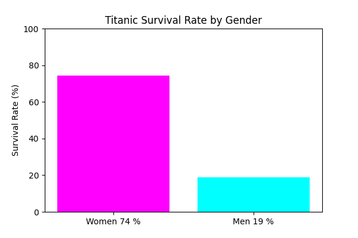
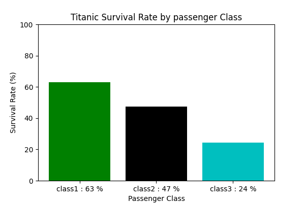
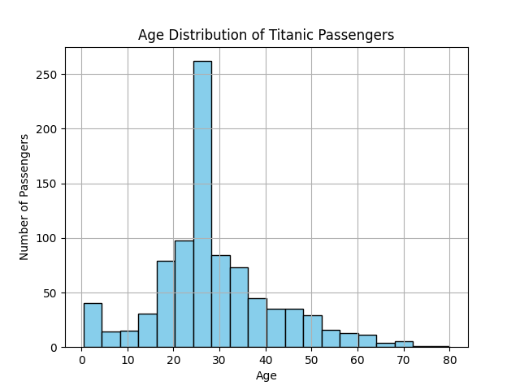
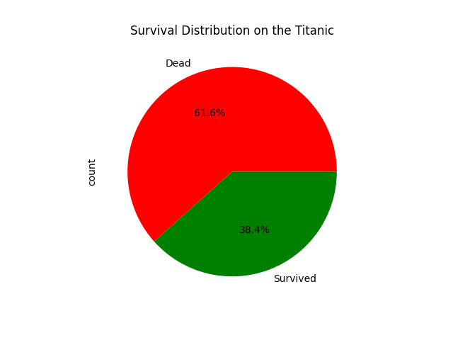
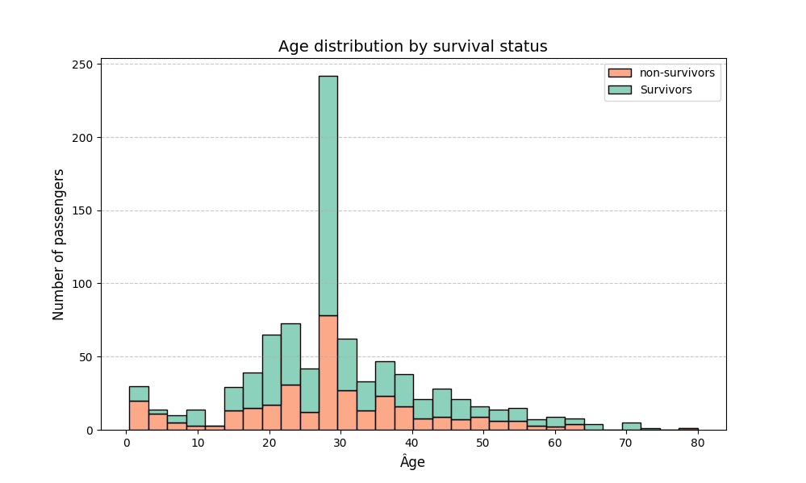
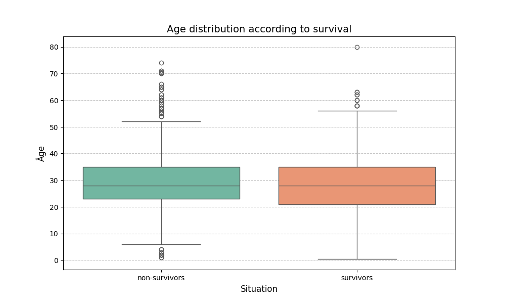

# Titanic Data Analysis

A complete data analysis project on the Titanic dataset using Python and popular data science libraries.


---

# Project Overview

This project focuses on:
- Data cleaning
- Data exploration
- Survival analysis
- Data visualization
- Correlation analysis

The goal is to better understand the factors that influenced passenger survival on the Titanic.


---

# Technologies & Libraries


---

# 📂 Project Structure
```bash
Titanic_Dataset_Exploration/
│
├── data/
│   └── Titanic-Dataset.csv
│
├── results/
│   └── donnees_nettoyees.csv
│
├── src/
│   ├── Data_exploration/
│   ├── analysis/
│   ├── Missing_data/
|	└── Visualization/
│
├── graph/
│
├── README.md
└── requirements.txt
```

---

# Data Cleaning

The following cleaning tasks were performed:

 Filled missing values in the Age column using the median  
 Filled missing values in the Embarked column using the mode  
 Created a new HasCabin feature  
 Saved the cleaned dataset

---

# Analyses Performed

## 🔹 Survival Rate by Gender

Women had a much higher survival rate than men.



---

## 🔹 Survival Rate by Passenger Class

First-class passengers had a much higher survival rate than third-class passengers.


---

## 🔹 Age Distribution of Passengers

Most Titanic passengers were young adults.


---

## 🔹 Survival Distribution

There were more deaths than survivors on the Titanic.


---

## 🔹 Correlation Heatmap

The heatmap shows relationships between numerical variables such as:
- Passenger class
- Fare
- Survival
- Age

Higher-class passengers and passengers who paid higher fares were more likely to survive.

---

# Visualizations Included

 Bar Charts  
 Pie Charts  
 Histograms  
 Boxplots  
 Heatmaps

---

# Additional Visualizations

## Age Distribution by Survival Status



---

## Boxplot of Age According to Survival



---

# Key Insights

- Women survived more than men
- Wealthier passengers had higher survival chances
- Passenger class strongly influenced survival
- Age had a weaker influence on survival

---

# Learning Objectives

This project helped practice:
- Data cleaning
- Data visualization
- Exploratory Data Analysis (EDA)
- Python programming
- Statistical interpretation

---

# Future Improvements

- Add machine learning models
- Predict passenger survival
- Build interactive dashboards
- Deploy the project online

---

# How to Run the Project

```bash
# clone the repository
git clone https://github.com/ralijaonafehizoro961-wq/Titanic_dataset_visualization.git
cd Titanic_dataset_visualization

# Install the dependence
pip install -r requirements.txt

# Run with this command
# ex : on linux
python3 src/Data_exploration/exp_data_01.py
python3 src/Missing_data/miss_data_01.py

# ex : on Windows
python src/Data_exploration/exp_data_01.py
python src/Missing_data/miss_data_01.py